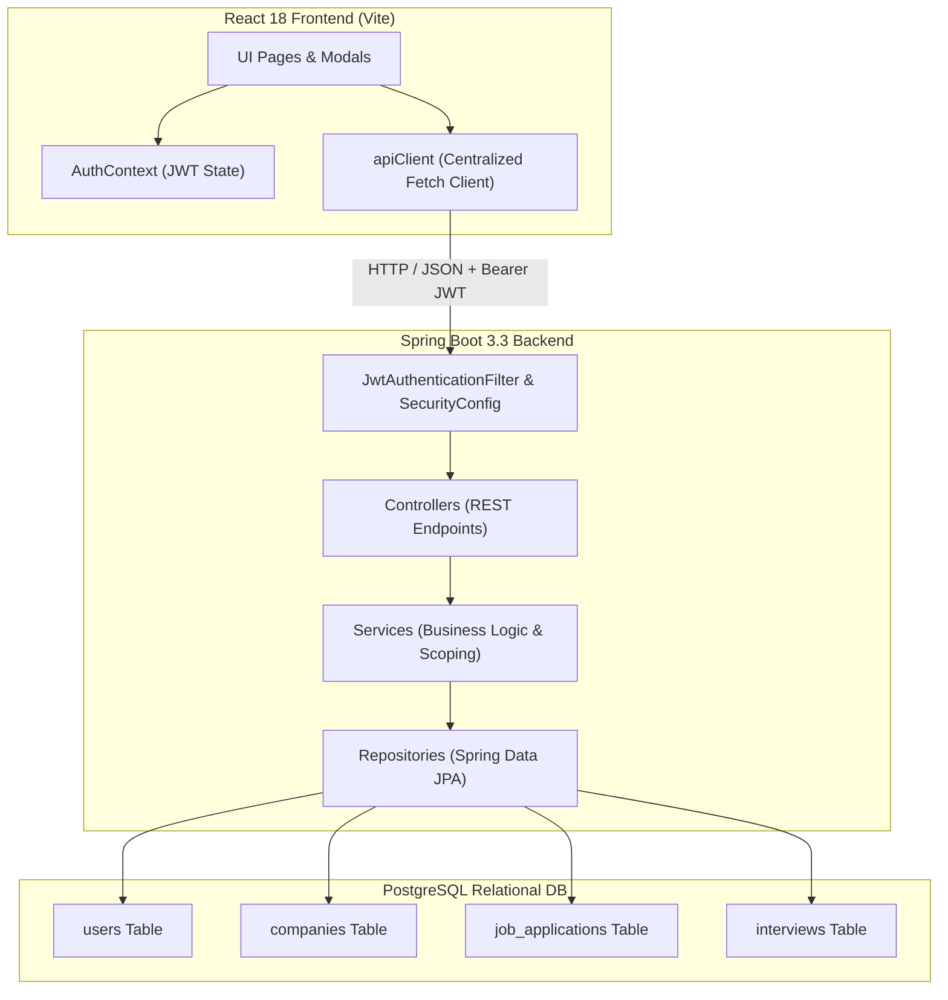
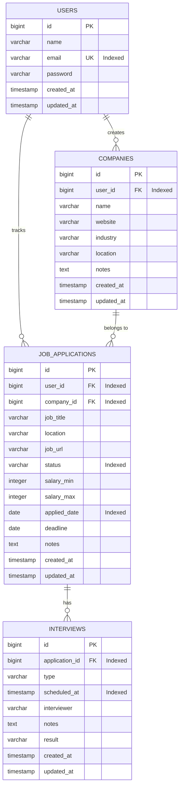

# CareerPulse - Full-Stack Job Application Management Platform

A full-stack portfolio project for managing a job search, built with **Java 21**, **Spring Boot 3.3.x**, **PostgreSQL**, and **React 18 / Vite**.

Includes **21 REST API operations**, four JPA entities, JWT-based authentication, user-scoped data access, PostgreSQL migrations, Docker Compose, and automated backend tests. The backend test suite has **56 passing tests** and **80.05% line coverage**.

**Live site:** [careerpulse-web-zrkl.onrender.com](https://careerpulse-web-zrkl.onrender.com) · **API health:** [careerpulse-api-t17q.onrender.com/actuator/health](https://careerpulse-api-t17q.onrender.com/actuator/health) · **Source:** [github.com/SHarsh671/careerpulse](https://github.com/SHarsh671/careerpulse)

The live app requires an account. Select **Sign up** to create one; there is no shared demo login. The API runs on Render's free plan and may take about a minute to wake after 15 minutes without traffic.

---

## Table of Contents
1. [Project Overview](#project-overview)
2. [Key Features](#key-features)
3. [Architecture & Design Decisions](#architecture--design-decisions)
4. [Tech Stack](#tech-stack)
5. [Database Schema](#database-schema)
6. [REST API Documentation](#rest-api-documentation)
7. [Getting Started & Local Setup](#getting-started--local-setup)
8. [Running with Docker Compose](#running-with-docker-compose)
9. [Live Deployment](#live-deployment)
10. [Automated Testing](#automated-testing)
11. [Environment Variables](#environment-variables)
12. [CI/CD Pipeline](#cicd-pipeline)
13. [Future Improvements](#future-improvements)

---

## Project Overview

Managing a software engineering job search across tens or hundreds of applications is notoriously error-prone. Spreadsheets lack real-time conversion metrics, deadline alerts, interview debrief notes, and status management.

**CareerPulse** solves this problem by providing job seekers with a dedicated command center:
- Track applications through each stage of the hiring lifecycle: `SAVED` → `APPLIED` → `OA` → `INTERVIEW` → `FINAL_INTERVIEW` → `OFFER` / `REJECTED` / `WITHDRAWN`.
- Schedule and log specific interview rounds (Online Assessments, Technical screens, Behavioral interviews, System Design, Final loops) with interviewer details and outcomes.
- View real-time calculated analytics: application volume, pipeline breakdown, interview conversion rate, and offer rate.
- Strict multi-tenant security ensuring complete data isolation between authenticated users.

---

## Key Features

- **Authentication & Security**:
  - Stateless JWT (JSON Web Token) authentication using `jjwt 0.12.x` and HMAC-SHA256.
  - Password hashing via Spring Security `BCryptPasswordEncoder` (cost factor 10).
  - Protected API endpoints with centralized `JwtAuthenticationFilter` and Spring Security 6 filter chain.
  - Strict resource ownership: Users can only query, modify, or delete their own companies, applications, and interviews.
- **Job Application Lifecycle**:
  - Multi-status workflow tracking: `SAVED`, `APPLIED`, `OA`, `INTERVIEW`, `FINAL_INTERVIEW`, `OFFER`, `REJECTED`, `WITHDRAWN`.
  - Comprehensive metadata: salary min/max, applied date, deadlines, job posting URLs, and notes.
  - Instant status transitions via dedicated `PATCH /api/applications/{id}/status`.
- **Target Company Management**:
  - Organize target employers with industry, headquarters location, website, and personal notes.
  - Quick inline company creation from within the application creation modal.
  - Referential integrity: Prevents deletion of companies that have associated applications.
- **Interview & Assessment Tracking**:
  - Track individual interview rounds linked to applications: `OA`, `PHONE`, `TECHNICAL`, `BEHAVIORAL`, `FINAL`.
  - Record interviewers, scheduled dates/times, notes, and outcomes (`PASSED`, `FAILED`, `PENDING`).
  - Automatic cascade deletion: removing an application cleanly purges associated interview history.
- **Dynamic Search, Filtering & Pagination**:
  - Filter applications by status, target company, and location.
  - Case-insensitive search across job titles, company names, and locations using Spring Data JPA Specifications.
  - Multi-column sorting (`appliedDate`, `jobTitle`, `status`, `deadline`, `createdAt`).
  - Pagination using `Pageable` and standardized `PagedResponse<T>` DTOs.
- **Real-Time Analytics Dashboard**:
  - Calculated KPIs: Total applications, active pipeline, interview rounds, offers received, and rejections.
  - Conversion rates: Interview Rate (`(OA + Interviews + Offers) / Active Pipeline`) and Offer Rate (`Offers / Active Pipeline`).
  - Recent applications feed for quick access to latest activity.
- **Responsive Modern UI**:
  - React 18 with Vite 5, React Router 6, and Lucide icons.
  - Clean CSS design with card layouts, responsive tables, badge pills, and interactive modals.
  - Reusable components with loading spinners, empty states, and validation alerts.

---

## Architecture & Design Decisions

CareerPulse adheres to a conventional, layered Spring Boot architecture designed for long-term maintainability without over-engineering:



### Major Architectural Decisions:

1. **Layered Conventional Architecture (`Controller → Service → Repository → Database`)**:
   - **Controllers remain thin**: Responsible solely for HTTP mapping, input validation (`@Valid`), and HTTP status return codes.
   - **Business logic lives in services**: Validation (e.g. `salaryMin <= salaryMax`), data scoping, rate calculations, and cross-entity validations happen in service classes.
   - **Persistence in repositories**: Uses Spring Data JPA repositories with custom derived queries and specifications.
   - **Constructor Injection**: All beans use constructor injection rather than field injection (`@Autowired` on private fields), ensuring immutability, testability, and no hidden dependencies.

2. **DTO Layer & Entity Decoupling**:
   - Internal JPA entities (`User`, `Company`, `JobApplication`, `Interview`) are never directly accepted as request bodies or returned in REST responses.
   - Distinct request (`JobApplicationRequest`, `CompanyRequest`, etc.) and response (`JobApplicationResponse`, `CompanyResponse`, etc.) DTOs prevent accidental over-posting and circular JSON serialization traps.

3. **Unidirectional JPA Relationships**:
   - Avoids bidirectional `@OneToMany` collections on parent entities to eliminate N+1 queries, memory overhead, and infinite recursion during serialization.
   - Uses `@ManyToOne(fetch = FetchType.LAZY)` on child entities (`JobApplication → Company`, `JobApplication → User`, `Interview → JobApplication`) with appropriate foreign key indexing.

4. **User-Scoped Isolation on All Resources**:
   - No data leak between users: Repositories enforce `findByIdAndUserId` or `findByApplicationIdAndApplicationUserId`.
   - Accessing another user's resource returns `404 Not Found` (rather than a permissive 200 or revealing 403), preventing attackers from enumerating valid resource IDs.

5. **Centralized Error Handling**:
   - `GlobalExceptionHandler` with `@RestControllerAdvice` translates Java exceptions into standard `ErrorResponse` objects with timestamps, HTTP status, and field-level validation error maps.

---

## Tech Stack

| Layer | Technologies |
| :--- | :--- |
| **Backend Language** | Java 21 (LTS) |
| **Framework** | Spring Boot 3.3.4 (Spring Web, Spring Security 6, Spring Data JPA, Hibernate 6) |
| **Authentication** | JWT (`io.jsonwebtoken:jjwt:0.12.5`), BCrypt |
| **Validation** | Bean Validation / Hibernate Validator (`jakarta.validation`) |
| **Database** | PostgreSQL (Docker Compose uses version 16; hosted version depends on provider), H2 (in-memory tests and local profile), Flyway migrations |
| **Build Tool** | Apache Maven 3.9+ |
| **Frontend Framework**| React 18, React Router v6 |
| **Frontend Build** | Vite 5 |
| **Styling & UI** | Custom Responsive CSS System, Lucide React Icons |
| **Testing** | JUnit 5, Mockito, Spring Boot Test, MockMvc |
| **Containers** | Docker (multi-stage Alpine builds), Docker Compose |
| **CI/CD** | GitHub Actions |

---

## Database Schema



---

## REST API Documentation

### Authentication (`/api/auth`)
| Method | Endpoint | Description | Auth Required |
| :--- | :--- | :--- | :--- |
| `POST` | `/api/auth/register` | Register a new user account | No |
| `POST` | `/api/auth/login` | Authenticate user and receive JWT token | No |
| `GET` | `/api/auth/me` | Retrieve authenticated user profile | Yes (Bearer) |
| `PUT` | `/api/auth/profile` | Update profile information or password | Yes (Bearer) |

### Companies (`/api/companies`)
| Method | Endpoint | Description | Auth Required |
| :--- | :--- | :--- | :--- |
| `GET` | `/api/companies` | List all companies created by user with application counts | Yes |
| `POST` | `/api/companies` | Create a new target company | Yes |
| `GET` | `/api/companies/{id}` | Get company by ID | Yes |
| `PUT` | `/api/companies/{id}` | Update company details | Yes |
| `DELETE` | `/api/companies/{id}` | Delete company if it has no associated applications | Yes |

### Job Applications (`/api/applications`)
| Method | Endpoint | Description | Auth Required |
| :--- | :--- | :--- | :--- |
| `GET` | `/api/applications` | Query applications with filters (`status`, `companyId`, `location`, `search`, `page`, `size`, `sort`) | Yes |
| `POST` | `/api/applications` | Create a new job application | Yes |
| `GET` | `/api/applications/{id}` | Get application details and interview count | Yes |
| `PUT` | `/api/applications/{id}` | Update application details | Yes |
| `PATCH` | `/api/applications/{id}/status` | Quick status transition | Yes |
| `DELETE` | `/api/applications/{id}` | Delete application and cascade interviews | Yes |

### Interviews (`/api`)
| Method | Endpoint | Description | Auth Required |
| :--- | :--- | :--- | :--- |
| `GET` | `/api/applications/{appId}/interviews` | List scheduled interviews for application | Yes |
| `POST` | `/api/applications/{appId}/interviews` | Schedule new interview round | Yes |
| `GET` | `/api/interviews/{id}` | Get interview round details | Yes |
| `PUT` | `/api/interviews/{id}` | Update interview details or outcome | Yes |
| `DELETE` | `/api/interviews/{id}` | Delete interview round | Yes |

### Dashboard (`/api/dashboard`)
| Method | Endpoint | Description | Auth Required |
| :--- | :--- | :--- | :--- |
| `GET` | `/api/dashboard` | Get computed statistics, rates, and recent activity | Yes |

---

## Getting Started & Local Setup

### Prerequisites
- **Java 21**
- **Node.js 20+** & **npm**
- **Maven 3.9+** (or use the provided `./mvnw` script)
- *(Optional)* **Docker & Docker Compose**

### Option A: Zero-Dependency Local Run (H2 In-Memory Mode)
For quick local testing without setting up PostgreSQL:

Open two terminals in the repository root and keep both running while you use the app.

1. **Start the Backend**:
   ```bash
   cd backend
   ./mvnw spring-boot:run -Dspring-boot.run.profiles=local
   ```
   *The Spring Boot backend will start on `http://localhost:8080` using an in-memory PostgreSQL-compatible database.*

2. **Start the Frontend**:
   ```bash
   cd frontend
   npm install
   npm run dev
   ```
   *The Vite development server will start on `http://localhost:5173` with automatic API proxying to port 8080.*

---

### Option B: Local Run with PostgreSQL

1. **Start PostgreSQL**:
   ```bash
   # Ensure a PostgreSQL instance is running on port 5432 with database `job_app_manager`
   createdb job_app_manager
   ```

2. **Configure Environment Variables**:
   Copy `.env.example` to `.env` and fill in credentials:
   ```bash
   cp .env.example .env
   ```

3. **Start the Backend**:
   ```bash
   cd backend
   export DATABASE_URL="jdbc:postgresql://localhost:5432/job_app_manager"
   export DATABASE_USERNAME="postgres"
   export DATABASE_PASSWORD="your_password"
   export JWT_SECRET="YourSuperSecretKeyForCareerPulseJWTAuthenticationMustBeLongerThan32Chars"
   ./mvnw spring-boot:run
   ```

4. **Start the Frontend**:
   ```bash
   cd frontend
   npm install
   npm run dev
   ```

---

## Running with Docker Compose

To run the entire full-stack application (PostgreSQL, Spring Boot backend, and Nginx-served React frontend) with a single command:

```bash
# 1. Create environment file from template
cp .env.example .env

# 2. Build and run containers
docker-compose up --build
```

Services exposed:
- **Frontend**: [http://localhost:3000](http://localhost:3000)
- **Backend API**: [http://localhost:8080](http://localhost:8080)
- **PostgreSQL**: `localhost:5432`

To shut down:
```bash
docker-compose down -v
```

---

## Live Deployment

The live application is hosted as a Render static site and Spring Boot web service, with PostgreSQL hosted separately on Supabase.

- **Website:** [https://careerpulse-web-zrkl.onrender.com](https://careerpulse-web-zrkl.onrender.com)
- **API health:** [https://careerpulse-api-t17q.onrender.com/actuator/health](https://careerpulse-api-t17q.onrender.com/actuator/health)
- **GitHub repository:** [https://github.com/SHarsh671/careerpulse](https://github.com/SHarsh671/careerpulse)

Create an account through the website's **Sign up** page to try the app. The project does not provide a shared demo account. Render's free API service spins down after 15 minutes without traffic; the first request after idle can take about a minute to wake. Supabase may pause Free Plan projects with low activity over a 7-day period. See [Render's free-plan limits](https://render.com/docs/free) and [Supabase's production checklist](https://supabase.com/docs/guides/deployment/going-into-prod).

### Deploying your own copy

The repository includes a Render Blueprint in `render.yaml` for the React static site and Dockerized Spring Boot API. The API needs an external PostgreSQL database; Supabase is one option.

1. Push this repository to GitHub and create a Supabase project.
2. In Supabase, open **Connect** and select the **Session pooler** connection. Render services use IPv4, while Supabase's direct connection on the free tier is IPv6; the session pooler is the compatible option. Convert the displayed `postgresql://...` connection into `jdbc:postgresql://<pooler-host>:5432/postgres?sslmode=require`. Set `DATABASE_USERNAME` to the pooler username shown by Supabase (usually `postgres.<project-ref>`) and `DATABASE_PASSWORD` to the database password.
3. In Render, choose **New → Blueprint**, connect the GitHub repository, and let it read `render.yaml`. Supply the three database environment variables when prompted.
4. After creation, copy the actual service URLs shown in Render. Set the static site's `VITE_API_URL` to `<API URL>/api` and the API's `CORS_ALLOWED_ORIGINS` to the exact static-site origin. Render may append a suffix to service URLs, so use the URLs shown in your dashboard rather than assuming they match the service names.

This setup is intended for a portfolio project. Render's own free PostgreSQL databases expire after 30 days, so use an external database for persistent data. See [Render's free-plan limits](https://render.com/docs/free) and [Supabase database connection options](https://supabase.com/docs/guides/database/connecting-to-postgres).

---

## Automated Testing

CareerPulse includes unit, service, and MockMvc integration tests. The suite contains **56 JUnit tests** covering authentication, application workflows, interview operations, company rules, dashboard calculations, validation, error mapping, JWT handling, and user data isolation. JaCoCo generates line and branch coverage reports and fails verification if aggregate line coverage falls below **80%**.

```bash
cd backend
./mvnw clean verify
```

The HTML coverage report is generated at `backend/target/site/jacoco/index.html`.

### Test Coverage Highlights:
- **`AuthIntegrationTest`**:
  - Tests user registration and JWT token response.
  - Tests duplicate email rejection (`409 Conflict`).
  - Tests Bean Validation error mapping (`400 Bad Request`).
  - Tests authentication and rejection of invalid passwords (`401 Unauthorized`).
  - Verifies secured endpoint protection against unauthenticated access.
- **`JobApplicationIntegrationTest`**:
  - Full end-to-end workflow: User registers → creates company → submits job application → updates status to `INTERVIEW` → schedules technical interview → inspects live dashboard statistics.
  - **User Isolation Verification**: Proves that User B cannot view, update, or delete User A's applications or companies (`404 Not Found`).
  - Tests cascading interview deletion when an application is removed.
- **`DashboardServiceTest`**:
  - Validates calculation of active pipeline, interview conversion rate, and offer rate formulas.
- **`JobApplicationServiceTest`**:
  - Validates salary range constraint (`salaryMin <= salaryMax`).
- **`CompanyServiceTest`**:
  - Validates business rule preventing company deletion while applications are linked.

---

## Environment Variables

| Variable | Default Value | Description |
| :--- | :--- | :--- |
| `DATABASE_URL` | `jdbc:postgresql://localhost:5432/job_app_manager` | PostgreSQL JDBC connection URL |
| `DATABASE_USERNAME` | `postgres` | Database username |
| `DATABASE_PASSWORD` | `postgres` | Database password |
| `JWT_SECRET` | Required for PostgreSQL / Docker; local H2 profile uses a development key | HMAC-SHA256 signature key |
| `JWT_EXPIRATION_MS` | `86400000` (24 hours) | JWT token lifespan in milliseconds |
| `CORS_ALLOWED_ORIGINS`| `http://localhost:5173,http://localhost:3000` | Allowed origins for CORS filter |
| `JPA_DDL_AUTO` | `validate` | Hibernate schema validation mode; Flyway applies PostgreSQL schema migrations |
| `SHOW_SQL` | `false` | Enable SQL query logging |

---

## CI/CD Pipeline

The repository includes a GitHub Actions workflow (`.github/workflows/ci.yml`) triggered on every pull request and push to `main` or `master`:
1. **Backend Pipeline**: Sets up Java 21, restores Maven dependency cache, runs `./mvnw clean verify`, packages the Spring Boot JAR, and uploads the JaCoCo report.
2. **Frontend Pipeline**: Sets up Node.js 20, caches dependencies from `package-lock.json`, runs `npm ci`, and builds the production bundle with Vite.

---

## Future Improvements

While CareerPulse intentionally focuses on clean, maintainable architecture rather than premature complexity, prospective enhancements include:
- **Email Notifications**: Scheduled reminders for upcoming interview rounds via Spring `@Scheduled` or an external mail provider (e.g. AWS SES / SendGrid).
- **Resume & Cover Letter Uploads**: S3 / MinIO integration for associating PDF resumes with specific job applications.
- **Kanban Board View**: Drag-and-drop column board interface as an alternative to the table view.
- **OAuth2 Social Login**: Google and GitHub login via `spring-security-oauth2-client`.
- **Metrics Export**: Micrometer Prometheus endpoint for production monitoring on Grafana / Datadog.

---

## License

This project is licensed under the MIT License.

